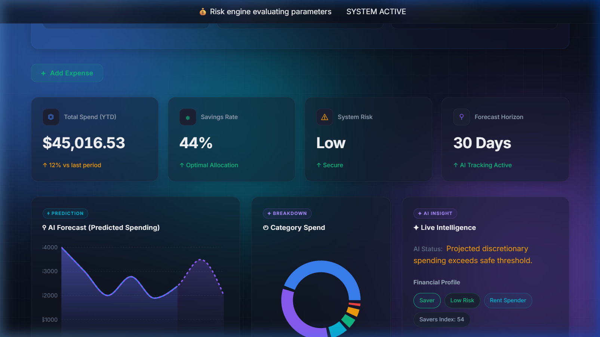
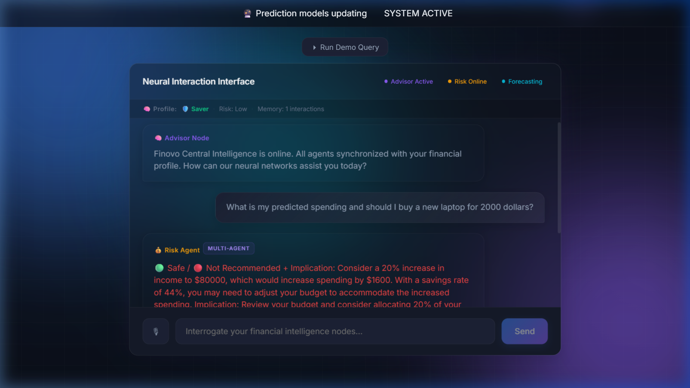

<div align="center">
  
  <h1>Finovo AI</h1>
  <p><b>Your Financial Intelligence System</b></p>
  <p>An enterprise-grade, multi-agent AI framework predicting financial velocity, automating insights, and dynamically securing your wealth.</p>

  <p>
    <a href="https://reactjs.org/"></a>
    <a href="https://nodejs.org/"></a>
    <a href="https://firebase.google.com/"></a>
    <a href="https://developer.nvidia.com/ai-models"></a>
  </p>

  <p>
    <a href="#-features"><strong>Explore Features</strong></a> ·
    <a href="#%EF%B8%8F-setup--installation"><strong>Quick Start</strong></a> ·
    <a href="#-architecture"><strong>Architecture</strong></a>
  </p>
</div>

---

## 🎬 Live Demo

Experience the intelligence firsthand:
**🌐 Live URL:** [https://finovo-ai.web.app](https://finovo-ai.web.app)

*Note: Add your demo GIF placeholder below by placing `demo.gif` inside the `./docs/assets/` folder.*

<div align="center">
  
</div>

---

## 🖼️ Screenshots

*Please place the corresponding images inside the `./docs/assets/` directory to render them.*

<details open>
<summary><b>Dashboard</b> — <i>Live AI Metrics & Stability System</i></summary>

<br>

</details>

<details>
<summary><b>AI Chat</b> — <i>Multi-Agent Neural Conversational Interface</i></summary>

<br>

</details>

<details>
<summary><b>Predictor</b> — <i>Financial Forecasting ("Can I afford this?")</i></summary>

<br>

</details>

<details>
<summary><b>Portfolio Tracker</b> — <i>Crypto & Stock Asset Tracking</i></summary>

<br>

</details>

---

## 🧠 Features

- **Smart Expense Intelligence:** Automated contextual breakdown of behavioral expenditure.
- **Multi-Agent AI System:** Intelligent swarm routing across `Advisor`, `Risk`, and `Future` logic nodes.
- **Financial Health Score:** Real-time stability tracking grading your baseline.
- **AI Predictions ("Can I afford this?"):** Predictive modeling simulating purchase impacts before they occur.
- **Conversational Finance Assistant:** 24/7 dedicated support leveraging cutting-edge LLMs.
- **Real-time Insights:** Dynamic generation of actionable micro-tips utilizing Recharts visualization.
- **Portfolio Tracker:** Unified platform handling stocks and crypto delta computations.

---

## 🧠 How It Works

1. **User adds transactions:** Provide input manually or upload historical behavior.
2. **AI analyzes behavior:** Background jobs aggregate distribution heuristics securely.
3. **System predicts and advises:** Financial health is dynamically adjusted and the multi-agent system actively recommends optimizations.

---

## 🏗️ Architecture

- **Frontend (React):** Utilizes Vite for High-Performance HMR, framer-motion for micro-interactions, and Recharts for responsive SVG visualization.
- **Backend (Express on Firebase Functions):** Serverless auto-scaling node architecture enforcing robust API abstraction.
- **Database (Firestore):** Real-time, NoSQL document syncing seamlessly pushing data to the client edge.
- **AI Layer (NVIDIA APIs):** Heavy-weight intelligence harnessing LLAMA models seamlessly via optimized prompting.

---

## 🔐 Security

- **Firebase Authentication:** Battle-tested user security and session management.
- **Token-based verification:** Strict stateless backend utilizing header-driven identity.
- **Firestore rules:** Lock-tight `read/write` definitions validating document ownership.
- **Secure backend:** Execution isolated behind strict rate-limits and CORS configuration.

---

## ⚡ Tech Stack

- **React** (Component Architecture & UI)
- **Firebase** (Google Cloud Ecosystem)
- **Node.js + Express** (Serverless Compute)
- **NVIDIA AI APIs** (Machine Learning Brain)
- **Recharts** (SVG Data Engines)
- **Framer Motion** (Animation Fluidity)

---

## 🛠️ Setup & Installation

### 1. Clone Repo
```bash
git clone https://github.com/NaveenCK-10/finovo-ai.git
cd finovo-ai
```

### 2. Install Dependencies
```bash
# Install backend dependencies
cd backend
npm install

# Install frontend dependencies
cd ../frontend
npm install
```

### 3. Add ".env"
Create a `.env` file in the **frontend** and **backend** directories following the provided `.env.example` configurations. (e.g., Firebase config keys and NVIDIA API endpoints).

### 4. Run Frontend
```bash
# Within the frontend directory
npm run dev
# The application will boot on http://localhost:5173
```

### 5. Run Backend
```bash
# Within the backend directory
npm run serve
```

---

## 🚀 Deployment

- **Firebase Hosting:** Deploy the optimized React build instantly via `firebase deploy --only hosting`.
- **Firebase Functions:** Push serverless Express endpoints globally utilizing `firebase deploy --only functions`.

---

## 📊 Future Improvements

- [ ] **Voice AI:** Direct integration for vocal transactional inputs.
- [ ] **Advanced analytics:** Deep cohort comparisons and machine-learning anomaly detection.
- [ ] **Investment tracking:** Unified APIs automating Plaid and Binance connections.
- [ ] **Real-time banking integration:** Live zero-latency sync via Open Banking standards.

---

## 🤝 Contributing

Contributions are inherently what make the global open-source community an amazing place to learn, inspire, and create. Any contributions made to Finovo AI are greatly appreciated.

1. Fork the Project
2. Create your Feature Branch (`git checkout -b feature/AmazingFeature`)
3. Commit your Changes (`git commit -m 'Add some AmazingFeature'`)
4. Push to the Branch (`git push origin feature/AmazingFeature`)
5. Open a Pull Request

---

<p align="center"><b>Built with passion to redefine personal finance using AI.</b></p>
